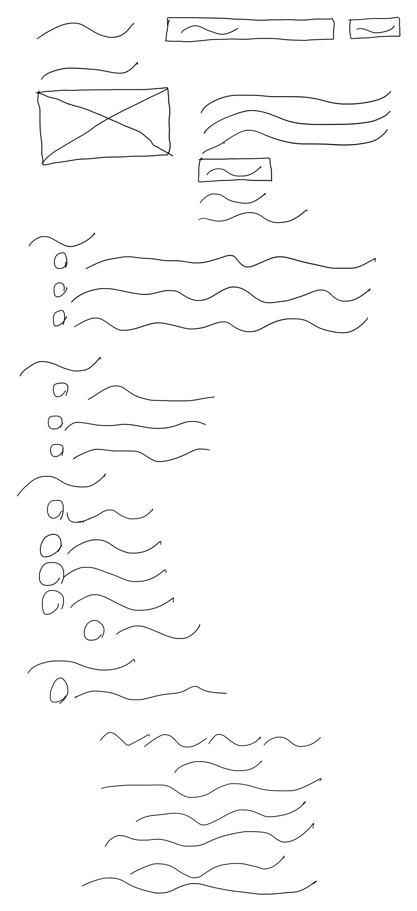
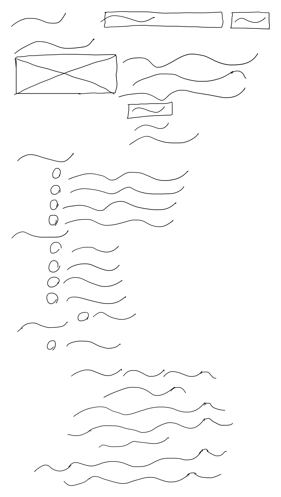
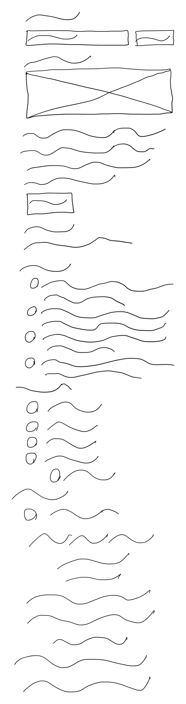

# 🧭 Annotator Guidelines: Responsive Website Wireframe Sketching

**Goal:**  
You will create **three clean wireframe sketches** (mobile, tablet, and desktop) that accurately represent how an existing webpage’s layout looks at each device size.

You are **not designing** a layout — you are **copying the actual layout structure** shown in the provided screenshots or the live webpage, using standard wireframe symbols.

---

## 1. Overview

For each assigned webpage (**Page ID**):

- Create **three sketches**, one for each device size:
  - 📱 **Mobile:** 375 × 688 px *(used only for viewport setup in DevTools — your sketch should cover the **entire scrollable page height**)*  
  - 💻 **Tablet:** 1024 × 1366 px *(iPad Pro; used only for viewport setup — sketch the **full page**, not limited to this height)*  
  - 🖥 **Desktop:** Minimum width **1280 px** *(used only for viewport setup — there is **no height or maximum width limit**; capture the **complete page** from top to bottom)*
- Each sketch must **faithfully reproduce** the real layout at that specific viewport width and device configuration.
- Focus on:
  - **Placement and size of elements**
  - **Page hierarchy and spacing**
  - **Responsive changes** (stacking, menu collapse, reflow)
  - **Full-page content**, including footer and all scrollable sections

---

## 2. Viewing the Website in the Correct Size

To ensure accuracy, **use Chrome Developer Tools** to view each layout:

1. Open the webpage in **Google Chrome**.  
2. Right-click anywhere on the page and select **Inspect** (or press `Ctrl+Shift+I` / `Cmd+Option+I`).  
3. Click the **Device Toolbar icon** (top-left corner of the DevTools panel).  
4. In the top toolbar, select the appropriate device:
   - For **Mobile**, select **iPhone SE (375 × 688)**  
   - For **Tablet**, select **iPad Pro (1024 × 1366)**  
   - For **Desktop**, choose **Responsive**, then manually set it to **at least 1280 px width** (no maximum)
5. Refresh the page after changing the device to make sure the responsive layout loads properly.  
6. **Scroll through the entire page** and sketch **all visible sections**, from header to footer — the specified sizes are for device width reference only, **not height limits**.

---

## 3. What to Copy

- Copy the **layout and structure** exactly — not the text, color, or images.  
- Pay attention to:
  - Header and navigation (position, visibility, menu style)
  - Image placement and scaling
  - Text block arrangement (columns vs stacked)
  - Sidebars (shown, hidden, or moved)
  - Footer layout  
- If an element disappears or changes at a smaller size, **show that difference clearly**.

---

## 4. What to Draw (Wireframe Symbols)

| Type | Symbol |
|------|--------|
| **Image / banner** | Rectangle with an **X** |
| **Text / paragraph** | Wavy lines |
| **Heading / title** | Wavy bold line(s) |
| **Button / input box** | Small rectangle |
| **Navigation bar / menu** | Horizontal bars; collapsed = hamburger icon |
| **Card / grid item** | Box grouping image + lines |
| **Icon** | Small square |
| **List / table** | Repeated horizontal lines |
| **Footer** | Box or wavy lines |

Keep all sketches **monochrome** (black pen/stylus on white background) and **freehand but neat**.

---

## 5. Step-by-Step Instructions

1. **Open the webpage or screenshot** for the assigned page.  
2. **Set the viewport size** in Chrome DevTools for:
   - **Mobile:** iPhone SE (375 × 688)  
   - **Tablet:** iPad Pro (1024 × 1366)  
   - **Desktop:** Responsive (minimum 1280 px width, no maximum)
3. For each size:
   - Observe the **structure carefully**
   - Draw the **entire scrollable page**, including all sections (header, hero, content, sidebar, footer)
   - Reproduce proportions and spacing as closely as practical — do **not crop** to the visible screen only
4. Label each sketch clearly:

Page ID: [name]  
Device: Mobile / Tablet / Desktop  
Annotator ID: [your code]

5. **Scan or photograph** sketches in good lighting.
- Image format: PNG or JPG  
- Minimum width: 2000 px  
- No glare, cropping, or shadow

---

## 6. Quality Checklist ✅

Before submission:
- [ ] All **three sizes** are completed  
- [ ] Sketches **match** the structure of the real webpage  
- [ ] Standard wireframe symbols are used consistently  
- [ ] Responsive differences are visible (stacking, hiding, resizing)  
- [ ] Sketches are labeled and legible  

---

## 7. Common Errors ❌

- Changing the layout yourself  
- Mixing multiple device layouts on one sheet  
- Adding real text, color, or images  
- Missing sections (e.g., footer, header)  
- Drawing with faint pencil or blurry photo  

---

## 8. File Naming

<page_id>-<annotator_id>.png

Examples:
1234-m-A1.png  
1234-t-A1.png  
1234-d-A1.png

---

## 9. Example Summary

| Device | Example Responsive Change |
|---------|---------------------------|
| Mobile (iPhone SE) | Nav collapses, columns stack |
| Tablet (iPad Pro) | Cards align in 2 columns |
| Desktop (≥1280 px) | Sidebar appears, full nav visible, full-page height captured |

### Visual Examples

**Example Page Wireframes**

| Desktop | Tablet | Mobile |
|----------|---------|--------|
|  |  |  |

**Page 58 Wireframes**

| Desktop | Tablet | Mobile |
|----------|---------|--------|
|  |  |  |